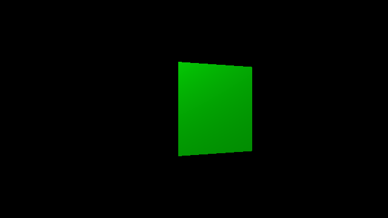

# Step 1: Three.jsのGetting Startedをやってみよう



Ref: [Three.js - Creating a scene](https://threejs.org/docs/index.html#manual/en/introduction/Creating-a-scene)

Three.jsはCDNから読みます:

```html
<script src="https://unpkg.com/three@0.108"></script>
```

### Three.jsとは

*Three.js* は、Web上での3DCGアプリケーションの開発に使えるライブラリです。
Web上で3DCGを実現するには *WebGL* というAPIを用いますが、
WebGLの学習コストはとても高く、3DCGに関する専門的な知識を多く必要とします。
Three.jsは、WebGLの面倒な手続きをすべて内部に含んでおり、
多くの3DCGアプリケーションの開発において本質的な部分にのみ集中することができます。

Three.jsは、その使いやすさから多くの採用実績があります。
[https://threejs.org](https://threejs.org)

### Rendererを作る

*Renderer* は、Three.jsの描画処理のほとんどを担当します。
今回は、 `WebGLRenderer` というのを使います。

```js
const renderer = new THREE.WebGLRenderer(); // WebGLRendererを作成
```

レンダラは、描画に必要なcanvasも一緒に作ってくれます。
canvasのサイズを変えたら、ドキュメントにcanvasを追加しましょう。

```js
renderer.setSize( width, height ); // Canvasの大きさを設定
document.body.appendChild( renderer.domElement ); // Canvasをドキュメントに追加
```

### Cameraを作る

Three.jsの世界では、ものを見るには *Camera* が必要です。
今回は、 `PerspectiveCamera` というCameraを用います。
引数としていろいろな数字を渡していますが、どれも3DCGの知識が必要な難しい引数のため、今回は気にしなくても良いです。

```js
const camera = new THREE.PerspectiveCamera( 30.0, width / height, 0.01, 20.0 ); // Cameraを作成
```

Cameraを作ったら、Cameraを少し移動しておきます。
3DCG空間内で物の位置を表すには、3次元ベクトルを用います。
Three.jsの世界では、x+が右、y+が上、z+が手前を表します。
また、距離単位は明確に定められていませんが、通常なにも指定がなければメートルと考えるのが良いでしょう。
ここでは、Cameraを手前に5mだけ動かしています。

```js
camera.position.set( 0.0, 0.0, 5.0 ); // Cameraを手前に移動
```

### Sceneを作る

Three.jsの世界に物を置くには、 *Scene* を作ります。
Sceneとは即ち空間であり、3DCGにおいて物が置かれる空間を表す場合、このSceneという語が一般に用いられます。

```js
const scene = new THREE.Scene(); // Sceneを作成
```

### 箱を作る

3Dオブジェクトである箱を作ります。
Three.jsにおいて、描画可能なものは *Mesh* として表現されることが多いです。
Meshは、 *Geometry* （形状）と *Material* （材質）から成り立つ概念です。
ここでは、箱型のGeometry・緑色のMaterialを作り、それからMeshを作成しています。

```js
const geometry = new THREE.BoxGeometry( 1.0, 1.0, 1.0 ); // 1辺が1.0の立方体のGeometry
const material = new THREE.MeshStandardMaterial( { color: 0x00ff00 } ); // 緑色のMaterial
const cube = new THREE.Mesh( geometry, material ); // geometryの形状を持ちmaterialの材質を持つものを作成
```

Meshが作成できたら、それをさきほど作ったSceneに追加しましょう。

```js
scene.add( cube ); // sceneに追加
```

### ライトを作る

このままのSceneでは、空間はどこをどう写しても真っ暗になってしまいます。
これは、Sceneにまだ *Light* が無いためです。

Lightとは名の通り光源であり、同じScene内にある物体を明るく照らします。
ここでは、 *平行光源* と呼ばれる、無限遠から一定方向に照射される光源を用います。

```js
const light = new THREE.DirectionalLight( 0xffffff ); // 白色の平行光源
light.position.set( 1.0, 1.0, 1.0 ).normalize(); // ライトの向きを設定
```

Lightを作ったら、忘れずにSceneに追加しましょう。

```js
scene.add( light ); // sceneに追加
```

### 描画する

描画をする前に、 *Clock* を用意しましょう。
Clockは時間を司るものです。今回は、箱を回転させるために必要となります。

```js
const clock = new THREE.Clock(); // 時間を司るクロックを作成
clock.start(); // clockを開始
```

それでは、描画処理を行う関数 `update` を作りましょう。

まず、 `clock.getDelta` で、前フレームとの時間差分を取得します。
次の行で `cube.rotation.y` にこの時間差分を足していますが、これによって箱が等速で回転するようになります。

`renderer.render` は、Rendererが指定されたCameraで指定したSceneを描画するメソッドです。

最後に `requestAnimationFrame` を実行することで、
`update` 関数が毎フレーム（通常1秒間に60回）呼ばれるようになります。

```js
function update() {
  const delta = clock.getDelta(); // 前回のupdateとの差分時間を取得

  cube.rotation.y += delta; // cubeを回転する

  renderer.render( scene, camera ); // 描画する

  requestAnimationFrame( update ); // 次のフレームにもう一回updateを呼ぶ
};
```

このままだと `update` の最初の一回が実行されないため、これを実行します。

```js
update(); // updateの最初の一回を呼ぶ
```
