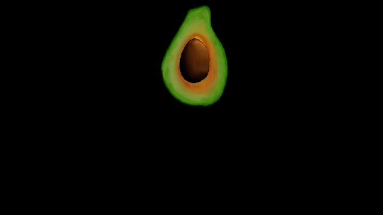

# Step 2: GLTFLoaderを使ってみよう



Ref: [GLTFLoader - three.js docs](https://threejs.org/docs/#examples/en/loaders/GLTFLoader)

ここでは、GLTFLoaderを用いて [アボカド](https://github.com/KhronosGroup/glTF-Sample-Models/tree/master/2.0/Avocado) を読んでみます。
このアボカドはMicrosoftがCC0で公開しているテスト用のアボカドです。

GLTFLoaderはCDNから読みます:

```html
<script src="https://unpkg.com/three@0.108/examples/js/loaders/GLTFLoader.js"></script>
```

### glTFとは

*glTF* は、簡単に言えば、3Dモデル用のフォーマットです。
汎用的な3Dモデルを表現するための最低限の仕様が一通り揃っており、ロイヤルティーフリーで誰でも使えるため、
最近ではいろいろなシチュエーションで用いられるようになっています。

See: [KhronosGroup/glTF - GitHub](https://github.com/KhronosGroup/glTF)

### GLTFLoaderを使う

*GLTFLoader* を使ってThree.jsでglTFファイルを読んでみましょう。

glTFは外部ファイルから読み込むため、処理が非同期的となります。
あらかじめ、読み込んだglTFを格納するための変数 `currentGLTF` と、
読み込み完了後の処理 `initGLTF` を作っておきましょう。

glTFを読み込んだ後は、Step 1でMeshをSceneに追加したように、モデルをSceneに追加する必要があります。
モデルは `gltf.scene` 内にあります。Sceneは子としてSceneを持つこともできます。

アボカド、そのままだとちょっと小さすぎたので（手のひらに乗ったアボカドの大きさを想像してください）、
大きさを20倍にしてみてください（その20倍の大きさのアボカドを想像してください）。

最後に、さきほど作った `currentGLTF` に読み込んだ `gltf` を代入しています。

```js
let currentGLTF = undefined; // 現在使用中のgltf、update内で使えるようにするため

function initGLTF( gltf ) { // モデルが読み込まれたあとの処理
  scene.add( gltf.scene ); // gltfのモデルをsceneに追加
  gltf.scene.scale.set( 20.0, 20.0, 20.0 ); // 小さすぎるので大きさを20倍に
  currentGLTF = gltf; // currentGLTFにgltfを代入
}
```

それでは、実際にGLTFLoaderでglTFを読み込んでみましょう。
`loader.load` には、モデルのURLおよび、完了時・進捗時・エラー時の処理を渡します。
完了時の処理として、先程定義した `initGLTF` を渡しましょう。

```js
const loader = new THREE.GLTFLoader(); // glTFモデルを読み込むにはGLTFLoaderを使う
loader.load( // モデルを読み込む
  'assets/Avocado.glb', // モデルデータのURL
  ( gltf ) => { initGLTF( gltf ); }, // モデルが読み込まれたあとの処理
  ( progress ) => { console.info( ( 100.0 * progress.loaded / progress.total ).toFixed( 2 ) + '% loaded' ); }, // モデル読み込みの進捗を表示
  ( error ) => { console.error( error ); } // モデル読み込み時のエラーを表示
);
```

### 描画する

updateについては、Step 1とほぼ同様です。

先のGLTFLoaderでのモデルデータの読み込み処理は非同期でしたね。
そのため、先ほどと違い、回転させる対象である `gltf.scene` がいつでも参照できるわけではありません。
そこで、ここでは `if ( currentGLTF )` で回転させる処理を囲うことにより、
`undefined` を参照しようとするのを防いでいます。

```js
if ( currentGLTF ) { // GLTFが読み込まれていれば
  currentGLTF.scene.rotation.y += delta; // GLTFを回転する
}
```
