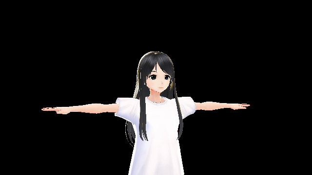
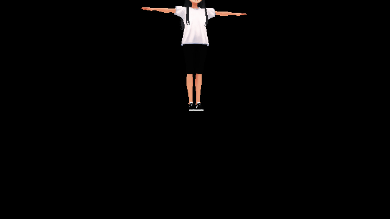
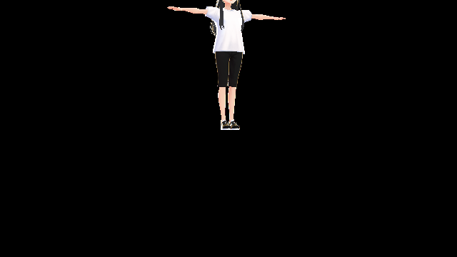

# Step 3: @pixiv/three-vrmを使ってみよう



それでは、@pixiv/three-vrmを使ってみましょう。
今回は、 [three-vrm-girl](https://github.com/pixiv/three-vrm/blob/master/examples/models/three-vrm-girl.vrm) という、@pixiv/three-vrm向けに作られたキャラクターを読み込んでみます。

@pixiv/three-vrmはCDNから読みます:

```html
<script src="https://unpkg.com/@pixiv/three-vrm@0.1/lib/three-vrm.js"></script>
```

### VRMとは

*VRM* は、3Dアバターに特化した3Dモデル用のフォーマットです。
これは、先程扱ったglTFをベースとして仕様が定義されています。
VRMには、3Dアバターを扱う上で便利な機能が多く含まれています。

See: [VRM](https://vrm.dev/)

### とりあえずglTFとして読む

上でも述べたとおり、VRMはglTFを拡張して定義されたフォーマットであるため、
とりあえず、VRMはglTFとしても読めるため、ひとまずGLTFLoaderで普通に読んでみましょう。
（initGLTFから、サイズを20倍にするコードを消しておいてください！身長が30mくらいのキャラクターが出てきてしまいます）

```js
const loader = new THREE.GLTFLoader(); // vrmをGLTFLoaderで読み込む
loader.load( // モデルを読み込む
  'assets/three-vrm-girl.vrm', // モデルデータのURL
  ( gltf ) => { initGLTF( gltf ); }, // モデルが読み込まれたあとの処理
  ( progress ) => { console.info( ( 100.0 * progress.loaded / progress.total ).toFixed( 2 ) + '% loaded' ); }, // モデル読み込みの進捗を表示
  ( error ) => { console.error( error ); } // モデル読み込み時のエラーを表示
);
```

下のようにモデルが表示されたはずです。



### @pixiv/three-vrmを使う

*@pixiv/three-vrm* は、Three.jsでVRMファイルを扱うためのライブラリです。
@pixiv/three-vrmは、GLTFLoaderと組み合わせて用います。

`initGLTF` に手を加え、glTFをVRMにします。

```js
let currentVRM = undefined; // 現在使用中のvrm、update内で使えるようにするため

function initVRM( gltf ) { // モデルが読み込まれたあとの処理
  THREE.VRM.from( gltf ).then( ( vrm ) => { // gltfをvrmにする
    scene.add( vrm.scene ); // vrmのモデルをsceneに追加
    currentVRM = vrm; // currentVRMにvrmを代入
  } );
}
```

これで、先程よりもきれいにVRMが表示されたはずです。
VRMの仕様では、MToonというマテリアルが定義されており、
通常のマテリアルよりも高度な描画を行うことができます。



### VRMの機能を使う: Boneの参照

VRMには、数多くの便利な機能が用意されています。
@pixiv/three-vrmでVRMの機能を使うには、以下のドキュメントを参照ください:

See: [Documentation of @pixiv/three-vrm](https://pixiv.github.io/three-vrm/docs/classes/vrm.html)

まず、あまりにもカメラの位置が雑なため、カメラが顔を映すように移動してみましょう。
VRMで記述されたアバターには、 *Humanoid Bone* が定義されています。
Humanoidは「人間型のもの」を表し、Boneはその人間型のものの「体の関節」を表します。

ここでは、頭を表すBone `Head` を参照し、カメラが頭を中心に映すようにカメラを移動してみます。

```js
function initVRM( gltf ) {
  THREE.VRM.from( gltf ).then( ( vrm ) => {
    ...

    const head = vrm.humanoid.getBoneNode( THREE.VRMSchema.HumanoidBoneName.Head ); // vrmのHeadを参照する
    camera.position.set( 0.0, head.getWorldPosition(new THREE.Vector3()).y, 2.0 ); // カメラを頭が中心に来るように動かす
  } );
}
```

これで、キャラクターの顔がよく見えるようになりました。


### VRMの機能を使う: SpringBoneを使う

次に、 *SpringBone* と呼ばれる機能を使ってみましょう。

SpringBoneは、その名の通り、Boneがばねのように動く機能です。いわゆる「揺れもの」です。
SpringBoneを使うには、 `vrm.update` を実行する必要があります。
これは、VRMの各機能が毎フレームの更新処理を行うために必要なメソッドです。

回転が一定速度だと、すこし揺れているのが分かりづらいので、サイン波で回転するようにします。

```js
function update() {
  ...

  if ( currentVRM ) { // VRMが読み込まれていれば
    currentVRM.scene.rotation.y = Math.PI * Math.sin( clock.getElapsedTime() ); // VRMを回転する

    currentVRM.update( delta ); // VRMの各コンポーネントを更新
  }

  ...
};
```

髪の毛がキャラクターの動きに応じて揺れるようになったのがわかると思います。
