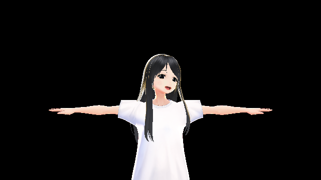
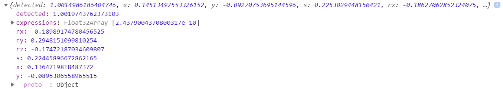
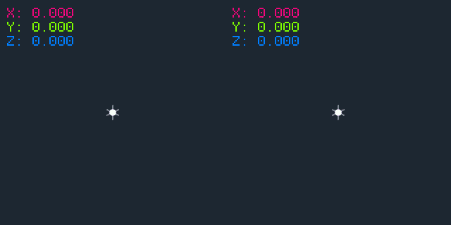
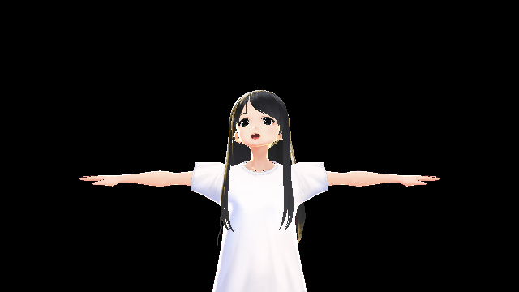
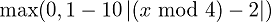
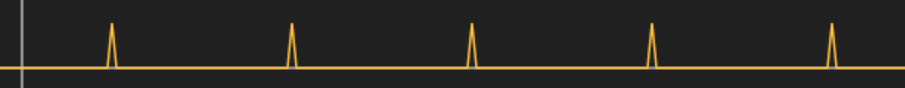

# Step 4: Jeelizと組み合わせてVTuberになろう



それでは、VTuberになってみましょう！
今回は、 [jeelizFaceFilter](https://github.com/jeeliz/jeelizFaceFilter) という、顔認識用のライブラリを使います。

jeelizFaceFilterは、CDNのファイルが古かったため、GitHubから直接落として使います。

以下のファイルを落としておきましょう:

- [`/dist/jeelizFaceFilter.js`](https://github.com/jeeliz/jeelizFaceFilter/blob/master/dist/jeelizFaceFilter.js)
- [`/helper/JeelizResizer.js`](https://github.com/jeeliz/jeelizFaceFilter/blob/master/helpers/JeelizResizer.js)
- [`/dist/NNC.json`](https://github.com/jeeliz/jeelizFaceFilter/blob/master/dist/NNC.json)

`jeelizFaceFilter.js` と `JeelizResizer.json` はHTMLから読み込みます:

```html
<script src="jeelizFaceFilter.js"></script>
<script src="JeelizResizer.js"></script>
```

`NNC.json` はassetsとして追加します。

### 顔認識をする

*jeelizFaceFilter* は、Webアプリケーション上で顔認識を行うライブラリです。
今回はこれと@pixiv/three-vrmを組み合わせて、Webカメラから顔認識して、VTuber風のアプリを作ってみます。

とりあえず、顔認識を行い、データを取り出してみましょう。

以下のコードは今回のハンズオンの本質ではないので、理解せずコピペで大丈夫です。
`handleJeelizTrack` 関数の中で何が行われているかだけ把握しておいてください。

```js
const jeelizCanvas = document.createElement( 'canvas' ); // jeeliz用のキャンバスを生成

function handleJeelizReady( error, spec ) { // jeelizの初期化処理が終わった際の処理
  if ( error ) { console.error( error ); return; } // エラーが有った場合、エラーを出力
}

function handleJeelizTrack( state ) { // jeelizのトラッキング情報が取得された際の処理
  console.log( state ); // トラッキング情報をコンソールに出力
}

function initJeeliz() {
  JEEFACEFILTERAPI.init( { // jeelizの初期化
    canvas: jeelizCanvas, // 顔認識に使うキャンバス
    NNCpath: 'https://unpkg.com/facefilter@1.1.1/dist/NNC.json', // データセットを指定
    followZRot: true, // Z回転を有効にする
    maxFacedDetected: 1, // 顔の最大認識数を指定
    callbackReady: handleJeelizReady, // 初期化処理が終わった際の処理
    callbackTrack: handleJeelizTrack // トラッキング情報が取得された際の処理
  } );
}

JeelizResizer.size_canvas( { // キャンバスを最適なサイズに調整する
  canvas: jeelizCanvas, // 顔認識に使うキャンバス
  callback: initJeeliz // キャンバスサイズ調整後の処理
} );
```

以下のようなデータが取得できたはずです:



### 顔の回転を反映させる

それでは、取得したデータを使ってVRMキャラクターの頭を回転してみましょう。

先程のデータの `rx` ・ `ry` ・ `rz` が頭の *オイラー角* を表しています。
オイラー角とは、3軸まわりの回転によって表された3次元物体の回転を表します。
比較的直感的な回転操作で、任意の回転が表せるのが特徴です。

このとき、オイラー角の回転順序に気をつける必要があります。
各軸の回転角が同じであっても、回転順序が違うと全く違う結果となってしまいます。
以下は、左が `"XYZ"` の順序、右が `"ZXY"` の順序で、各軸とも同じ確度だけ回転させた状態を示していますが、
最終的な結果は大きく異なることがわかると思います。



Three.js で扱われるオイラー角 [`THREE.Euler`](https://threejs.org/docs/#api/en/math/Euler) においても、
回転順序を指定できるため、忘れず指定を行いましょう。
今回は、 `"ZXY"` と指定すると良い感じになるようです。

回転方向の符号については、x回転以外は多少好みがあると思いますので、お好きに変えていただければと思います。

```js
function handleJeelizTrack( state ) { // jeelizのトラッキング情報が取得された際の処理
  if ( currentVRM ) { // もしcurrentVRMがあれば
    const head = currentVRM.humanoid.getBoneNode( THREE.VRMSchema.HumanoidBoneName.Head ); // VRMのHeadを取得
    head.rotation.set( -state.rx, -state.ry, state.rz, 'ZXY' ); // 頭の回転をVRMに反映
  }
}
```

### 口の開き具合を反映させる

VRMには、表情を制御するための機構も定義されており、 *BlendShape* と呼ばれます。
VRMキャラクターにあらかじめ定義された、表情を制御する数値を0から1の範囲で変更することで、
キャラクターに表情をつけることができます。

Jeelizでは、顔の角度だけでなく、口の開き具合を取ることもできます。
そこで、口の開き具合をキャラクターにそのまま反映してみましょう。

```js
function handleJeelizTrack( state ) { // jeelizのトラッキング情報が取得された際の処理
  if ( currentVRM ) { // もしcurrentVRMがあれば
    ...

    const expressionA = state.expressions[ 0 ]; // 口の開き具合
    currentVRM.blendShapeProxy.setValue( THREE.VRMSchema.BlendShapePresetName.A, expressionA ); // 口の開き具合をVRMに反映
  }
}
```

ひとまず、それっぽくなってきましたね！



### 発展: こっちを向いてもらう

VRMには *LookAt* という、視線を制御するための仕様も定義されています。
せっかくなので、カメラ目線を送ってもらいましょう。

```js
function initVRM( gltf ) {
  ...

  vrm.lookAt.target = camera; // 常にカメラ方向を向く
}
```

### 発展: Tポーズをやめてもらう

キャラクター、Tポーズしててダサいですよね。
Tポーズとは、アルファベットのTのような姿勢の事を言い、
現代においては、だいたいの3Dモデルはこの状態で元データが収録されていると推測します。
VRMにおいても、Tポーズでデータを収録することが仕様で定められています。

キャラクターをもう少しまともなポーズにしてみましょう。
以下のjsonを `pose.json` という名前で保存し、読み込んでみましょう。

```json
{
  "hips": {
    "rotation": [  0.000000,  1.000000,  0.000000,  0.000000 ]
  },
  "leftShoulder": {
    "rotation": [  0.000000,  0.000000,  0.087156,  0.996195 ]
  },
  "rightShoulder": {
    "rotation": [  0.000000,  0.000000, -0.087156,  0.996195 ]
  },
  "leftUpperArm": {
    "rotation": [  0.000000,  0.000000,  0.500000,  0.866025 ]
  },
  "rightUpperArm": {
    "rotation": [  0.000000,  0.000000, -0.500000,  0.866025 ]
  },
  "leftLowerArm": {
    "rotation": [  0.000000,  0.000000,  0.087156,  0.996195 ]
  },
  "rightLowerArm": {
    "rotation": [  0.000000,  0.000000, -0.087156,  0.996195 ]
  }
}
```

```js
function initVRM( gltf ) {
  ...

  THREE.VRM.from( gltf ).then( ( vrm ) => {
    fetch( 'pose.json' ) // ポーズデータを読み込む
      .then( ( res ) => res.json() ) // JSONに変換
      .then( ( json ) => vrm.humanoid.setPose( json ) ); // VRMにポーズを適用
  } );
}
```

### 発展: まばたきをしてもらう

瞬きしてもらいましょう。
`Blink` という名前のBlendShapeを制御します。

以下のグラフは  です。
それっぽいので、これを使いましょう。



```js
function update() {
  ...

  if ( currentVRM ) {
    ...

    const blink = Math.max( 0.0, 1.0 - 10.0 * Math.abs( ( clock.getElapsedTime() % 4.0 ) - 2.0 ) ); // まばたきのウェイト
    currentVRM.blendShapeProxy.setValue( THREE.VRMSchema.BlendShapePresetName.Blink, blink ); // まばたきのウェイトを制御する
  }

  ...
};
```

### 発展: マウスで表情を制御する

マウス位置で表情を制御しましょう。
`Fun` ・ `Sorrow` ・ `Angry` ・ `Joy` という名前のBlendShapeがあります。

```js
renderer.domElement.addEventListener( 'mousemove', ( event ) => { // マウスイベントの取得
  if ( currentVRM ) { // もしcurrentVRMがあれば
    const x = event.clientX / renderer.domElement.clientWidth; // マウスのx位置、正規化されている
    currentVRM.blendShapeProxy.setValue( THREE.VRMSchema.BlendShapePresetName.Fun, x ); // マウスのx位置を表情に反映

    const y = event.clientY / renderer.domElement.clientHeight; // マウスのy位置、正規化されている
    currentVRM.blendShapeProxy.setValue( THREE.VRMSchema.BlendShapePresetName.Sorrow, y ); // マウスのy位置を表情に反映
  }
} );
```


### 発展: まだまだいろいろ

- 現状だと首しか動いていないので、顔の位置を使って、体全体を動かすと良いかもしれません。
  - おそらく、 [IK](https://www.google.com/search?q=inverse+kinematics) という機構が必要となります。
  - [けしごむ/Nono](https://twitter.com/ke4563) さんの実装が参考になりそう: [VautaSolo](https://vautasolo.netlify.com/)
- 口パクは、映像入力だけでなく音声入力を利用すると、もっとそれらしく見えるかもしれないですね。
- 眼球にマイクロサッケードを足したりすると、よりリアリティが増すかもしれません。
  - @pixiv/three-vrmの場合、 [`VRMLookAtHead`](https://pixiv.github.io/three-vrm/docs/classes/vrmlookathead.html) を継承することで実現可能かも
- 表情認識をすると表情が顔から取れそう。ただ、実用的な精度を持っているわけではないので、みんなボタン等を使っているそうです。
- [Leap Motion](https://www.leapmotion.com/ja/) というハンドトラッキングデバイスをつなげたりすると、手を動かせたりします。
  - 参考として、 [Luppet](https://luppet.appspot.com/) というソフトウェアが極めて優秀です。
